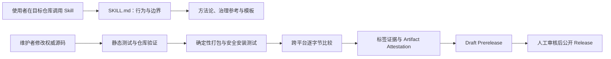

# 项目上手指南：Build Engineering Harness

> 本文面向接手维护仓库的人。使用者的快速安装与 Prompt 示例从 [`README.md`](../README.md) 开始；英文入口是 [`README.en.md`](../README.en.md)。最新公开版本只以 [GitHub Releases](https://github.com/NaCr05/build-engineering-harness-skill/releases) 为准。

## 两分钟概览（Two-Minute Overview）

Build Engineering Harness 是一个面向 Codex 的软件工程 Skill。它帮助 Agent 先从仓库事实理解项目，再按风险选择合适的 Harness 强度，提出可审查方案，并且只在用户明确批准后实施。对于 AI 或 Agent 项目，它还会检查 Prompt、Context、Tool、Memory、输出 Schema、失败处理、成本、延迟和可靠性。

这个仓库不是需要长期运行的 Web 服务，也没有数据库。核心产品是一棵可安装的 Markdown Skill；Python 标准库工具负责验证、打包、证据哈希和安全安装，GitHub Actions 负责跨平台验证与可信发布。

维护时优先记住三条规则：

1. [`skill/build-engineering-harness/SKILL.md`](../skill/build-engineering-harness/SKILL.md) 是运行行为的权威来源；中文说明和公开 README 必须跟随实际行为同步。
2. 普通 Harness 工作采用两阶段契约：先只读评估和提案，得到明确批准后才可修改；项目收尾模式只能写 `docs/project-retrospective.md` 与 `docs/project-onboarding.md`。
3. 不修改已有场景运行目录，不覆盖已公开 Release 资产，不在测试或文档中放入凭据、个人路径或私有仓库内容。

仓库自 2026-08-06 起暂停主动维护。此状态不表示仓库已归档，也不提供 Issue、PR、安全修复或新版本的时限承诺。当前边界见 [`CONTRIBUTING.md`](../CONTRIBUTING.md) 和 [`SECURITY.md`](../SECURITY.md)。

## 目标用户与核心工作流（Target Users and Core Workflow）

| 用户 | 典型目标 | 核心工作流 |
|---|---|---|
| 项目负责人或个人开发者 | 判断一个初步完成的项目离“可协作、可开源、可维护”还有什么差距 | 安装 Skill → 在目标仓库请求只读体检 → 审查事实、风险和方案 → 批准选定范围 → 验证实施结果 |
| 多人团队维护者 | 治理 README、docs、AGENTS.md、决策记录与当前状态之间的冲突 | 请求知识治理审计 → 建立工件角色和更新语义 → 明确权威来源、所有者和验证关系 → 批准后实施 |
| AI/Agent 系统开发者 | 补足模型调用之外的工程契约和评测闭环 | 常规工程审计 + Prompt/Context/Tool/Memory/Schema/失败处理检查 → 设计 Accuracy/Latency/Cost/Reliability 证据 |
| 项目交接者 | 为暂时停更或交接的仓库留下可复用知识 | 显式请求 project-closeout → 生成基于证据的复盘与上手指南，不改产品代码 |
| 本仓库维护者 | 安全修改 Skill、测试或安装/发布链 | 先定位权威文件 → 做最小变更 → 同步说明和 Changelog → 本地验证 → PR CI → 必要时标签和人工审核 Draft Release |

## 技术栈与架构（Tech Stack and Architecture）

| 层 | 技术或格式 | 职责 |
|---|---|---|
| Skill 产品 | Markdown、YAML | 定义触发条件、操作契约、方法论、模板和对 Codex 的公开元数据 |
| 仓库工具 | CPython 3.10–3.13，仅标准库 | 静态验证、Changelog 与追加历史检查、证据哈希、确定性打包、安装和跨平台产物比较 |
| 安装入口 | PowerShell 7、POSIX `sh` | 调用统一 Python 安装器，传递版本、资产目录、目标 `CODEX_HOME` 和 dry-run 参数 |
| 测试 | `unittest`、JSON Schema v2 证据、Markdown 响应 | 验证仓库不变量、安装失败路径及 L1/L2/L3 代表性行为 |
| 自动化 | GitHub Actions、GitHub CLI、Artifact Attestation | 多操作系统/多 Python 版本验证、产物上传和比较、标签证据、资产认证及 Draft Prerelease |
| 发布治理 | Git 标签、GitHub Release、Ruleset、MIT | 保护 `main` 与版本标签，保留人工发布确认，公开可认证的版本化安装资产 |



运行时路径与发布路径彼此独立：使用者调用已安装 Skill 时不需要执行仓库脚本；维护者只有在验证、打包、安装测试或发布时才使用 Python 和 GitHub Actions。

## 目录地图与关键入口（Directory Map and Key Entry Points）

| 路径 | 主要角色 | 何时阅读或修改 |
|---|---|---|
| [`README.md`](../README.md) | 中文公开入口 | 了解定位、安装、Prompt、信任模型和导航；用户体验或公开说明变化时同步 |
| [`README.en.md`](../README.en.md) | 英文公开入口 | 与中文 README 保持语义同步 |
| [`skill/build-engineering-harness/SKILL.md`](../skill/build-engineering-harness/SKILL.md) | 运行行为权威 | 所有 Skill 行为、触发条件、授权边界和工作流变更首先在这里确定 |
| [`skill/build-engineering-harness/SKILL.zh-CN.md`](../skill/build-engineering-harness/SKILL.zh-CN.md) | 中文运行说明 | 在英文权威行为变化后同 PR 同步 |
| [`skill/build-engineering-harness/references/`](../skill/build-engineering-harness/references/) | 稳定方法与详细规则 | 修改 Playbook、知识治理模型或项目收尾模板时使用 |
| [`skill/build-engineering-harness/assets/`](../skill/build-engineering-harness/assets/) | 可复制输出模板 | 修改正式知识审计交付结构时使用 |
| [`skill/build-engineering-harness/agents/openai.yaml`](../skill/build-engineering-harness/agents/openai.yaml) | Codex 发现元数据 | 修改名称、描述或默认 Prompt 时使用 |
| [`scripts/`](../scripts/) | 仓库验证、打包与安装工具 | 改不变量、证据格式、产物格式或安装安全行为时使用 |
| [`tests/static/`](../tests/static/) | 机器可执行回归测试 | 任何脚本、结构、文档同步或安全规则变化都应有对应测试 |
| [`tests/scenarios/`](../tests/scenarios/) | L1/L2/L3 前向评测 | 修改 Skill 判断和边界时新增运行证据；历史 `runs/` 只追加 |
| [`tests/installation/`](../tests/installation/) | 安装验证证据 | 安装器或发布包输入变化后更新隔离验证结果 |
| [`.github/workflows/validate.yml`](../.github/workflows/validate.yml) | CI 与发布状态机 | 修改兼容矩阵、构建、Attestation 或 Draft Release 规则时使用 |
| [`VERSION`](../VERSION) / [`CHANGELOG.md`](../CHANGELOG.md) | 版本与版本历史 | 只有准备发布相关变更时更新；普通收尾文档无需升版 |
| [`CONTRIBUTING.md`](../CONTRIBUTING.md) / [`SECURITY.md`](../SECURITY.md) | 贡献与安全边界 | 查维护状态、支持范围、验证要求和私密漏洞报告方式 |
| [`docs/project-retrospective.md`](project-retrospective.md) | 收尾历史 | 了解关键决策、已解决问题、遗留风险与可复用资产 |

## 数据流（Data Flow）

### Skill 使用流

1. Codex 根据安装目录中的元数据和描述识别 Skill。
2. Agent 读取 `SKILL.md`，再按任务类型选择工程 Harness 模式或项目收尾模式。
3. Agent 根据路由只读取任务需要的方法论、治理参考或模板。
4. 工程 Harness 模式先检查目标仓库并输出方案；只有用户明确批准后才写入获批范围。
5. Agent 运行目标仓库已有的安全验证，并区分“已验证”“已实现但未验证”和“仍为计划”。
6. 结果回传给用户；Skill 本身不维护远程数据库或跨任务业务状态。

### 验证与发布流

1. 维护者修改权威源码，并按变更范围同步中文说明、公开文档、测试和 `CHANGELOG.md` 的 `Unreleased`。
2. 本地静态测试和仓库验证检查结构、链接、同步关系、证据与安全不变量。
3. 打包器读取 `VERSION` 与 Skill 树，生成固定归档、checksum、manifest 和安装器资产。
4. PR CI 在 Windows、Ubuntu、macOS 与 Python 3.10–3.13 支持矩阵上运行验证；Windows/Linux 独立产物随后逐字节比较。
5. 版本标签还会触发发布证据检查、Artifact Attestation 和 Draft Prerelease 创建或刷新。
6. 人工核对 Draft 后公开；同名 Release 一旦公开，工作流拒绝覆盖其资产。

## 安装、运行与测试（Install, Run, and Test）

### 准备条件（Prerequisites）

- Git，用于克隆和提交。
- CPython 3.10–3.13。仓库工具不依赖第三方 Python 包。
- Windows 安装包装器使用 PowerShell 7；Ubuntu/macOS 使用 POSIX `sh`。
- 验证或下载公开 Release 时安装 GitHub CLI，并完成 `gh auth login`；`gh attestation verify` 必须可用。
- WSL、Windows PowerShell 5.1 和其他 Unix 属于尽力支持范围，不是当前 CI 保证。

### 安装（Installation）

维护仓库无需安装依赖：

```text
git clone https://github.com/NaCr05/build-engineering-harness-skill.git
cd build-engineering-harness-skill
python --version
```

如果目标是安装 Skill 给 Codex 使用，请严格按 [`README.md` 的安装章节](../README.md#安装)执行：从已经公开的固定版本下载六项资产，先逐项运行 `gh attestation verify`，再运行安装器 dry-run，最后正式安装。不要从未知来源直接执行安装脚本，也不要把 `main` 当成公开版本资产。

### 配置（Configuration）

仓库验证不需要 `.env`、API Key、数据库或外部服务。

安装器只关心以下配置：

- `CODEX_HOME`：可选；未设置时使用用户目录下的 `.codex`。
- `--codex-home` / `-CodexHome`：测试时把安装目标指向一次性目录，避免覆盖真实 Skill。
- 版本和资产目录：必须与经过 Attestation 验证的公开 Release 一致。

不要把真实凭据、个人绝对路径、私有仓库 Fixture 或敏感输出提交进仓库。

### 运行（Run）

该项目没有需要启动的常驻进程。安装完成后，新建一个 Codex 任务让 Skill 目录重新加载，然后在目标仓库中使用 `$build-engineering-harness`。可从 [`README.md` 的常用 Prompt](../README.md#常用-prompt)复制起点。

维护者若只想检查当前仓库，直接运行下节命令即可；不需要启动服务或安装 Node 依赖。

### 测试与验证（Test and Verify）

在仓库根目录依次运行：

```text
python -m unittest discover -s tests/static -v
python scripts/validate_repository.py
python scripts/build_release_package.py --output-dir .test-runs/release-package
python scripts/validate_repository.py --release
```

预期信号：

- 静态测试全部通过；Windows 无创建符号链接权限时，相关拒绝测试可以按测试说明跳过一次。
- 仓库验证器报告结构、链接、证据、安装与发布规则均有效。
- 打包器生成归档、checksum、manifest、PowerShell/POSIX 包装器，并打印归档与 Skill 文件树 SHA-256。
- `--release` 检查要求当前提交、版本、标签和发布证据满足发布条件；普通开发分支不准备发版时，以前三项为主要本地验证。

PR 上还会额外执行：

- `scripts/check_append_only_runs.py`：禁止改写或删除历史场景运行。
- `scripts/check_changelog.py`：发布相关范围变化时要求同步 `Unreleased`。
- Windows/Linux 产物逐字节比较，以及 Ubuntu、Windows、macOS 的兼容矩阵。

前向场景不是每次文档修改都重新调用 Agent。需要更新行为证据时，先阅读 [`tests/README.md`](../tests/README.md)，使用新 `run_id` 追加结果，并保留失败记录；不要修改既有运行来制造绿灯。

## 常见开发任务（Common Development Tasks）

| 任务 | 最小修改面 | 必须验证或同步 |
|---|---|---|
| 调整 Skill 行为或授权边界 | `SKILL.md`，必要时对应 reference/template | 同步 `SKILL.zh-CN.md`、相关 README、静态测试、`CHANGELOG.md`；判断是否需新增 L1/L2/L3 运行 |
| 调整知识治理方法 | `repository-knowledge-governance.md` 或审计模板 | 保持六类角色、更新语义和主要角色规则一致；运行链接/结构验证，必要时追加 L2 场景 |
| 调整 AI/Agent 检查维度 | Playbook 与 `SKILL.md` 路由 | 静态同步检查、相关文档、`CHANGELOG.md`，必要时追加 L3 场景 |
| 新增前向评测 | 新 Fixture、Prompt、Expected 和新的 `runs/<run-id>/` | 隔离执行，期望答案不提供给被测 Agent；记录 Schema v2 哈希、门禁、评分与限制；历史只追加 |
| 修改验证器或证据规则 | `scripts/validate_repository.py`、`evidence_hashes.py` 等 | `tests/static/` 回归、仓库验证、现有证据兼容性和 `CHANGELOG.md` |
| 修改打包内容或安装器 | 打包器、Python 安装器、两个平台包装器 | 路径穿越/符号链接/篡改/回滚测试，确定性构建，隔离 `CODEX_HOME` 安装证据，`CHANGELOG.md` |
| 准备 Beta 发布 | `VERSION`、`CHANGELOG.md` 和必要发布说明 | PR CI 全绿 → 合并 → 创建受保护标签 → 检查 Attestation 与 Draft 资产 → 人工公开；禁止修改已公开资产 |
| 恢复主动维护 | 维护声明、依赖和工具链策略 | 先处理私密安全报告，恢复 Dependabot 计划更新，审计固定 Action SHA 与兼容矩阵，重跑安装证据和代表性前向场景，再承诺新计划 |

## 易错点与排障（Gotchas and Troubleshooting）

- **中文显示乱码：** 仓库文件使用 UTF-8。Windows PowerShell 读取中文时先确认终端和读取命令使用 UTF-8；不要因为终端显示问题重写文件编码。
- **Changelog 门禁失败：** 检查 PR 是否修改 `skill/`、`scripts/`、`tests/`、公开治理文件或 GitHub 工作流；这些发布相关变化必须更新 `CHANGELOG.md` 的 `Unreleased`。仅新增本项目收尾文档不属于发布内容。
- **追加历史门禁失败：** 不要修改、移动或删除 `tests/scenarios/*/runs/` 中已有文件。修正评测方法时创建新的 `run_id`，旧失败也必须保留。
- **本地打包哈希不同：** 确认工作树、`VERSION`、Skill 树和来源提交完全一致。不要手工修改生成的 manifest、checksum 或归档。
- **安装被拒绝：** 先核对六项 Release 资产来自同一版本，Attestation 绑定正确仓库、标签和签名工作流；再检查 manifest、归档和文件哈希。校验失败应停止，不要绕过安全检查。
- **升级中断：** 安装器会先备份现有 Skill 并在失败时回滚。测试恢复流程时只使用一次性 `--codex-home` / `-CodexHome`，不要在真实目录制造故障。
- **安装后看不到 Skill：** 新建一个 Codex 任务触发目录重新加载。当前没有自动化覆盖 Desktop 目录即时刷新。
- **符号链接测试在 Windows 跳过：** 普通用户可能没有创建符号链接权限；一次有明确原因的跳过是已知限制，不代表其他安装安全测试可忽略。
- **发布工作流在公开标签上失败：** 这是设计行为。若同名 Release 已公开，工作流禁止覆盖资产；需要修复时走新版本，不要删除或替换既有公开证据。
- **CI 中 Action 版本看起来较旧：** 所有 Action 都固定到完整提交 SHA。维护暂停期不会自动追新；恢复维护时集中审计来源和升级，不能改成浮动标签规避更新工作。
- **外部反馈长期没有响应：** 当前处于维护暂停期，没有 Issue、PR、安全修复或发布 SLA。安全问题仍应按 [`SECURITY.md`](../SECURITY.md) 私密报告，不要公开漏洞细节。

如需理解“为什么形成这些约束”，阅读 [`project-retrospective.md`](project-retrospective.md)；如需确认当前公开版本、资产和认证，以 [GitHub Releases](https://github.com/NaCr05/build-engineering-harness-skill/releases) 为准。
