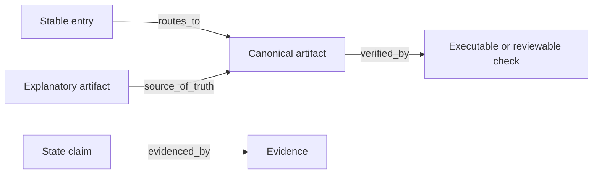

# Repository Knowledge Governance Audit

> Copy this template into the target repository or working output only when the user requests a formal audit. Match the user's language and repository conventions. Remove instructional placeholders before delivery.

## Audit profile

| Field | Value |
|---|---|
| Repository | `<name or path>` |
| Audit date | `<YYYY-MM-DD>` |
| Scope | `<directories and artifact types inspected>` |
| Target maturity | `<L1 / L2 / L3>` |
| Repository risk | `<low / medium / high, with reason>` |
| Evidence limitations | `<unavailable history, commands not run, inaccessible systems, or none>` |

## Executive summary

**Overall conclusion:** `<ready / ready with gaps / not ready for the stated target>`

`<Summarize the repository's knowledge architecture, strongest existing mechanisms, most important risks, and the smallest useful next step. Distinguish observed facts from inference.>`

## Artifact registry

Register homogeneous directories once and add rows for file-level exceptions. Use zero to two comma-separated secondary roles or `none`.

| Artifact | Primary role | Secondary roles | Update semantics | Authority | Authority scope | Owner | Update trigger | Verification | Enforcement | Enforced by | Relations |
|---|---|---|---|---|---|---|---|---|---|---|---|
| `<path>` | `<one role>` | `<0–2 roles>` | `<one mode>` | `<canonical / explanatory / evidence>` | `<bounded scope>` | `<owner>` | `<event>` | `<check or review>` | `<level>` | `<mechanism or none>` | `<typed directed links>` |

Allowed roles:

- `navigation_routing`
- `rules_boundaries`
- `specifications_contracts`
- `state_evidence`
- `rationale_history`
- `execution_verification`

Allowed update semantics:

- `stable_entry`
- `synchronized`
- `append_only`
- `derived_generated`

Allowed relations:

- `routes_to`
- `source_of_truth`
- `evidenced_by`
- `verified_by`
- `generated_from`
- `supersedes`

## Coverage matrix

Record artifact counts or representative paths. Empty cells are valid and are not findings by themselves.

| Primary role \ Update semantics | Stable entry | Synchronized | Append-only | Derived/generated |
|---|---:|---:|---:|---:|
| Navigation and routing |  |  |  |  |
| Rules and boundaries |  |  |  |  |
| Specifications and contracts |  |  |  |  |
| State and evidence |  |  |  |  |
| Rationale and history |  |  |  |  |
| Execution and verification |  |  |  |  |

### Coverage interpretation

- `<Explain only gaps that matter for the target maturity and repository risk.>`
- `<Do not recommend artifacts solely to populate empty cells.>`

## Authority analysis

### Canonical scopes

| Authority scope | Canonical artifact | Overlap or conflict | Resolution needed |
|---|---|---|---|
| `<scope>` | `<path>` | `<none or evidence>` | `<action or none>` |

### Explanations and evidence

- Explanatory artifacts without a locatable `source_of_truth`: `<list or none>`
- Material state claims without `evidenced_by`: `<list or none>`
- Canonical artifacts with overlapping scope: `<list or none>`

## Relationship analysis



Replace the example with the smallest graph that exposes important routes or failures.

- Broken or dangling targets: `<list or none>`
- Orphaned canonical artifacts: `<list or none>`
- Unjustified cycles: `<list or none>`
- Routes without a canonical, verified, or evidenced terminal: `<list or none>`

## Lifecycle and enforcement

| Artifact or rule | Declared update behavior | Observed behavior | Current enforcement | Recommended level | Rationale |
|---|---|---|---|---|---|
| `<path or rule>` | `<mode and trigger>` | `<evidence>` | `<level>` | `<level>` | `<risk, frequency, detectability>` |

## Findings

### Findings summary

| ID | Priority | Artifact | Finding | Recommended action |
|---|---|---|---|---|
| `RKG-001` | `<P0–P3>` | `<path>` | `<concise observed problem>` | `<concise action>` |

### Finding detail

```yaml
id: RKG-001
priority: P2
artifact: <path>
location: <file, line, section, or command>
observed_fact: <reproducible observation>
violated_contract: <model rule or repository rule>
impact: <concrete consequence>
recommendation: <smallest effective change>
target_enforcement: <documented / review_required / automated_warning / automated_blocking / structural_prevention>
confidence: <high / medium / low, with reason when not high>
```

Repeat the detail block for every material finding. Keep inferences explicitly labeled.

Priority definitions:

- **P0:** immediate security, integrity, irrecoverability, or severe misleading-authority risk.
- **P1:** likely wrong action, contract violation, or unreliable agent execution.
- **P2:** drift, maintenance burden, broken navigation, or unclear responsibility.
- **P3:** quality improvement or higher-maturity opportunity.

## Proposed changes

Do not implement this section during the read-only audit phase.

| Priority | File or mechanism | Create/update | Purpose | Verification |
|---|---|---|---|---|
| `<P0–P3>` | `<path or check>` | `<create / update>` | `<specific result>` | `<command or review evidence>` |

## Decisions required

- `<One focused user-owned decision per bullet, with a recommended answer.>`

## Deferred or intentionally absent items

| Item | Reason deferred or unnecessary | Revisit trigger |
|---|---|---|
| `<artifact, matrix cell, or enforcement upgrade>` | `<proportionality rationale>` | `<event>` |

## Verification plan

- `<Existing checks to run first>`
- `<New checks proposed, if approved>`
- `<Expected evidence of success>`
- `<Known environmental or access limitations>`
