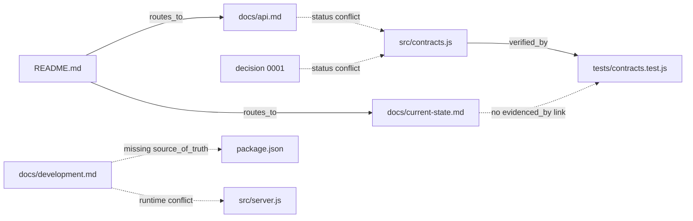

# Repository Knowledge Governance Audit

## Audit profile

| Field | Value |
|---|---|
| Repository | `l2` disposable team-project fixture |
| Audit date | 2026-08-05 |
| Scope | Repository root, `docs/`, `src/`, `tests/`, manifests, instructions, contracts, decisions, current-state claims, and local verification commands |
| Target maturity | L2 — Managed |
| Repository risk | Medium: a small internal service, but several developers make weekly changes and its executable and documented contracts already disagree |
| Evidence limitations | No `.git` metadata exists at the scoped root; parent lookup was prohibited, so history and actual update behavior were unavailable. No CI configuration exists in scope. `npm test` itself was not run; its underlying command, `node --test`, was run directly. |

## Executive summary

**Overall conclusion: not ready for L2.**

The repository has useful L1 ingredients: a compact entry document, root-scoped contributor instructions, an executable status contract, one automated test, development instructions, API documentation, a current-state document, and a decision record. However, the artifacts do not form a reliable knowledge system:

- The documented account-status contract says `active`/`inactive`, while the executable contract and test say `enabled`/`disabled`.
- Three mutually incompatible operational stories exist: port `3000`, port `4100` with `/health`, and an implementation that creates no HTTP server and exits immediately.
- `docs/current-state.md` says the service is production-ready, all checks pass, and documentation matches implementation; the latter two broad claims are unsupported or contradicted.
- No central registry declares authority, owners, update triggers, controlled relationships, or verification.
- The decision record is explicitly mutable and records neither rationale nor supersession, so it does not provide L2 append-only decision history.
- The one passing test verifies only the status predicate.

The smallest useful L2 improvement is one corrective governance change set: designate executable contracts as current canonical truth, reconcile the false documentation, add a machine-readable central registry with role ownership and triggers, preserve decision history through supersession, and extend the existing test command with deterministic registry and contract-synchronization checks.

## Verified project understanding

### Verified facts

- `README.md:1-3` describes an internal HTTP service for reading account status.
- `docs/api.md:3-12` documents `GET /accounts/:id` and the values `active` and `inactive`.
- `src/contracts.js:1-5` implements the values `enabled` and `disabled`.
- `src/server.js:1-8` contains only account serialization; it contains no listener, route, health endpoint, port, or HTTP-server construction.
- `package.json:5-8` maps `npm start` to `node src/server.js` and `npm test` to `node --test`.
- `tests/contracts.test.js:6-9` checks that `enabled` is accepted and `active` is rejected.

### Inferences

- The intended users are internal API consumers and the developers maintaining the service.
- The intended input is an account identifier; the intended output is an account object containing `id` and `status`.
- The HTTP service is planned or incompletely implemented. This is an inference from the documentation; the inspected implementation does not deliver it.
- `src/contracts.js` is the strongest candidate for current canonical status truth because it is executable and directly tested. The repository does not formally declare that authority.

## Verification evidence

| Check | Result | Interpretation |
|---|---|---|
| `node --test` | Exit 0; 1 test, 1 passed, 0 failed | The status predicate behaves as asserted. This does not verify the API, server startup, health endpoint, serialization failure path, documentation synchronization, or production readiness. |
| `node src/server.js` | Exit 0 immediately, no output | The configured start target does not keep an HTTP service running. |
| Scoped file inventory | 10 files; no registry, CI configuration, PR template, or `.git` entry at the scoped root | L2 governance and hosted enforcement are absent in the audited scope. |

No project file or cache was created or modified.

## Artifact registry

These classifications are auditor-assigned; the repository contains no declared registry. “Undeclared” means the repository does not specify the field.

| Artifact | Primary role | Secondary roles | Update semantics | Authority | Authority scope | Owner | Update trigger | Verification | Enforcement | Relations |
|---|---|---|---|---|---|---|---|---|---|---|
| `README.md` | `navigation_routing` | `execution_verification` | `stable_entry` | canonical for repository entry routing | Repository onboarding | Undeclared | Undeclared | Manual only | `documented` | Explicitly `routes_to` API and current state |
| `AGENTS.md` | `rules_boundaries` | none | `stable_entry` | canonical | Repository-wide contributor behavior | “the team,” not identifiable | Undeclared | Manual only | `documented` | None declared |
| `package.json` | `execution_verification` | `specifications_contracts` | `synchronized` | canonical | Local command mapping | Undeclared | Script or workflow change | Commands are executable | `automated_blocking` when invoked | Effective `verified_by` Node |
| `docs/development.md` | `execution_verification` | `navigation_routing` | `synchronized` | explanatory | Local development workflow | Undeclared | Undeclared | None | `documented` | Missing `source_of_truth`; conflicts with runtime |
| `docs/api.md` | `specifications_contracts` | none | `synchronized` | de facto canonical | HTTP response and status values | Undeclared | Undeclared | None | `documented` | Overlaps and conflicts with executable contract |
| `docs/current-state.md` | `state_evidence` | none | `synchronized` | evidence | Delivery readiness | Undeclared | Undeclared | No cited evidence | `documented` | No `evidenced_by` relation |
| `docs/decisions/0001-user-status.md` | `rationale_history` | `specifications_contracts` | `synchronized` as currently instructed | de facto canonical | Supported status values | Undeclared | Any supported-value change | None | `documented` | Conflicts with executable contract; no `supersedes` |
| `src/contracts.js` | `specifications_contracts` | none | `synchronized` | de facto executable canonical | Accepted account-status values | Undeclared | Behavior change | Partial unit test | `automated_blocking` when tests run | Effective `verified_by` test |
| `src/server.js` | `specifications_contracts` | none | `synchronized` | executable | Implemented serialization/runtime behavior | Undeclared | Behavior change | No direct test | none | None declared |
| `tests/contracts.test.js` | `execution_verification` | `state_evidence` | `synchronized` | evidence | Status predicate behavior | Undeclared | `AGENTS.md` says behavior changes | `node --test` | `automated_blocking` when invoked | Verifies part of `src/contracts.js` |

## Coverage matrix

| Primary role \ Update semantics | Stable entry | Synchronized | Append-only | Derived/generated |
|---|---:|---:|---:|---:|
| Navigation and routing | 1 | 0 | 0 | 0 |
| Rules and boundaries | 1 | 0 | 0 | 0 |
| Specifications and contracts | 0 | 3 | 0 | 0 |
| State and evidence | 0 | 1 | 0 | 0 |
| Rationale and history | 0 | 1 | 0 | 0 |
| Execution and verification | 0 | 3 | 0 | 0 |

### Coverage interpretation

- Empty cells are not inherently defects.
- The material L2 gap is the absence of append-only decision history, not the number of artifacts.
- No derived/generated artifacts are needed for this repository.
- The synchronized artifacts lack declared triggers, owners, and synchronization checks.

## Authority analysis

| Authority scope | Canonical candidates | Conflict | Resolution needed |
|---|---|---|---|
| Repository routing | `README.md` | It omits `docs/development.md` and the decision history | Add routes to maintained workflow and decision artifacts |
| Local commands | `package.json`, `README.md`, `docs/development.md` | Start commands agree syntactically, but port/runtime claims do not | Treat `package.json` plus executable behavior as canonical |
| HTTP runtime | `README.md`, `docs/development.md`, `docs/api.md`, `src/server.js` | Ports `3000` and `4100` disagree; implementation exposes neither | Remove unsupported runtime claims or separately implement/test HTTP behavior |
| Account-status vocabulary | `docs/api.md`, decision 0001, `src/contracts.js` | `active`/`inactive` conflicts with `enabled`/`disabled` | Account Contract Owner must select one canonical vocabulary |
| Delivery readiness | `docs/current-state.md` | “Production ready” and “documentation matches” lack valid evidence | Replace with finite, evidence-backed status |
| Contributor contract approval | `AGENTS.md` | “Ask the team” has no identifiable authority or approval record | Name an accountable owner role and review requirement |

Explanatory artifacts without a locatable `source_of_truth`:

- `docs/development.md`
- Operational claims in `README.md`

Material state claims without `evidenced_by`:

- All claims in `docs/current-state.md:3-5`

Overlapping canonical scopes:

- Status values: `docs/api.md:12`, `docs/decisions/0001-user-status.md:3`, `src/contracts.js:1`
- Runtime behavior: `README.md:12`, `docs/development.md:3`, `src/server.js:1-8`

## Relationship analysis



- Broken literal README targets: none; both linked files exist.
- Broken semantic routes: the API route ends at a contract that disagrees with executable behavior; the state route ends at unsupported readiness claims.
- Orphaned maintained artifacts: `docs/development.md` and the decision record are not routed from the entry document.
- Unjustified cycles: none observed.
- Routes without a canonical, verified, or evidenced terminal: runtime setup and current readiness.
- Controlled relationships are not declared centrally anywhere.

## Lifecycle and enforcement

| Artifact or rule | Declared update behavior | Observed state | Current enforcement | Recommended level |
|---|---|---|---|---|
| Root navigation | None | Routes omit maintained workflow and decisions | `documented` | `review_required` plus deterministic target validation |
| “Keep documentation accurate” | Generic rule at `AGENTS.md:3` | Multiple documented facts conflict with code | `documented` | `review_required`; deterministic contract drift should be `automated_blocking` |
| Contract changes require team approval | `AGENTS.md:5` | No owner, approval mechanism, or affected-file list | `documented` | `review_required` |
| API/status synchronization | None | Documentation and implementation disagree | none | `automated_blocking` |
| Decision history | File says edit whenever values change | Historical meaning can be silently replaced | `documented` | `review_required` with append-only supersession |
| Current-state maintenance | None | Broad unsupported claims | `documented` | `review_required` with evidence fields |
| Tests for behavior changes | `AGENTS.md:4` | Only status predicate is tested | Local `automated_blocking` when invoked | Retain; add contract and registry checks |
| Registry integrity | Absent | No authority/owner/trigger graph | none | Local `automated_blocking` |

## Prioritized findings

### Findings summary

| ID | Priority | Artifact | Finding | Recommended action |
|---|---|---|---|---|
| RKG-001 | P1 | Contract artifacts | Documented and executable status vocabularies conflict | Designate one canonical contract and enforce synchronization |
| RKG-002 | P1 | Runtime documentation and source | Ports/endpoints are mutually inconsistent and no HTTP server exists | Correct documentation to verified behavior; treat server implementation separately |
| RKG-003 | P1 | `docs/current-state.md` | Production-readiness claims are unsupported and partly false | Replace with finite status plus direct evidence |
| RKG-004 | P2 | Repository-wide | L2 registry, ownership, triggers, and controlled relationships are absent | Add one central machine-readable registry |
| RKG-005 | P2 | Decision 0001 | Decision history is mutable and lacks rationale/supersession | Supersede it with a proper append-only ADR |
| RKG-006 | P2 | Entry/rules/workflow | Navigation and scoped instructions do not identify owners or synchronization duties | Add exact routes, owner roles, triggers, and review requirements |
| RKG-007 | P2 | Tests | Passing coverage is too narrow to support readiness or API claims | Add deterministic governance/contract checks and eventual HTTP integration coverage |

### Finding detail

```yaml
id: RKG-001
priority: P1
artifact: docs/api.md; docs/decisions/0001-user-status.md; src/contracts.js; tests/contracts.test.js
location: docs/api.md:12; docs/decisions/0001-user-status.md:3; src/contracts.js:1; tests/contracts.test.js:6-9
observed_fact: Documentation declares active/inactive, while executable code declares enabled/disabled and the test explicitly rejects active.
violated_contract: Canonical authority scopes must not overlap without a declared relationship; synchronized artifacts must change with their underlying truth.
impact: A developer or API consumer can implement or approve incompatible behavior.
recommendation: Designate src/contracts.js as current canonical truth unless the Account Contract Owner decides otherwise; reconcile docs and record the semantic decision through supersession.
target_enforcement: automated_blocking
confidence: high
```

```yaml
id: RKG-002
priority: P1
artifact: README.md; docs/development.md; docs/api.md; src/server.js
location: README.md:7-12; docs/development.md:3; docs/api.md:3; src/server.js:1-8; command "node src/server.js"
observed_fact: README claims port 3000, development instructions claim port 4100 and /health, API docs claim an accounts route, while the complete server source creates no HTTP listener and the configured process exits immediately.
violated_contract: Explanatory operational documentation must point to and agree with canonical executable behavior.
impact: Developers cannot follow the documented workflow and may falsely treat an absent endpoint as delivered.
recommendation: Correct entry, development, API, and state documents to say that only contract validation/serialization exists. Treat implementing HTTP behavior as a separately approved product change.
target_enforcement: review_required
confidence: high
```

```yaml
id: RKG-003
priority: P1
artifact: docs/current-state.md
location: docs/current-state.md:3-5
observed_fact: The file claims production readiness, all checks passing, documentation parity, and no gaps; only one narrow test was found and passed, while contract and runtime documentation visibly disagree with source.
violated_contract: Material state claims require evidence and a finite status vocabulary.
impact: Maintainers may release, hand off, or plan from a materially misleading readiness statement.
recommendation: Replace prose assertions with explicit component statuses, evidence references, last-verified date/command, known gaps, and an accountable owner.
target_enforcement: review_required
confidence: high
```

```yaml
id: RKG-004
priority: P2
artifact: repository-wide
location: scoped inventory of all 10 files
observed_fact: No artifact declares the L2 classification, authority scope, owner, update trigger, verification, enforcement, or typed relationships in a central registry.
violated_contract: L2 requires a central registry, explicit ownership, controlled relationships, and synchronization checks.
impact: Weekly multi-developer changes have no reliable way to discover which artifact governs a fact or what must change with it.
recommendation: Add docs/knowledge-governance.json and validate its required fields, targets, and canonical-scope uniqueness through the existing Node test runner.
target_enforcement: automated_blocking
confidence: high
```

```yaml
id: RKG-005
priority: P2
artifact: docs/decisions/0001-user-status.md
location: docs/decisions/0001-user-status.md:1-5
observed_fact: The document records only a current value set and instructs maintainers to edit it whenever values change; it contains no context, alternatives, consequences, reopening condition, identifier metadata, or supersession link.
violated_contract: Decision history should be append-only; substantive changes require supersedes rather than silent rewriting.
impact: The reason for a contract change cannot be reconstructed, and past decisions can disappear.
recommendation: Preserve 0001, mark it superseded, and add 0002-account-status-contract.md with a complete decision record.
target_enforcement: review_required
confidence: high
```

```yaml
id: RKG-006
priority: P2
artifact: README.md; AGENTS.md
location: README.md:14; AGENTS.md:3-5
observed_fact: The entry routes only to API and state documents; the scoped instructions say to ask “the team” but identify no accountable owner, required approval evidence, affected artifacts, or update triggers.
violated_contract: L2 artifacts require explicit ownership, routing, and lifecycle triggers.
impact: Contributors can follow the written instructions yet still miss workflow and decision artifacts or obtain inconsistent contract approval.
recommendation: Route all maintained knowledge classes from README and add trigger/owner rules to AGENTS.md.
target_enforcement: review_required
confidence: high
```

```yaml
id: RKG-007
priority: P2
artifact: tests/contracts.test.js
location: tests/contracts.test.js:6-9; node --test result
observed_fact: The only discovered test verifies two calls to isAccountStatus; it does not cover serialization, invalid serialization, HTTP behavior, documentation synchronization, registry integrity, or readiness claims.
violated_contract: Verification must cover important normal behavior, boundaries, and failure paths in proportion to risk.
impact: A green local test can coexist with a broken developer workflow and contradictory public contract.
recommendation: Add registry and documentation-contract checks now; add HTTP integration tests only when an HTTP server is actually implemented.
target_enforcement: automated_blocking
confidence: high
```

## Smallest L2 governance improvement

Use one corrective change set, with no product feature implementation:

| Priority | Exact file | Change | Owner | Update trigger | Verification |
|---|---|---|---|---|---|
| P1 | `docs/knowledge-governance.json` | Create the central registry using the required L2 fields and typed relationships | Service Maintainer | Artifact added/moved; authority, ownership, trigger, or relationship changes | New Node test parses JSON, verifies required enums/fields, unique artifact paths, existing targets, controlled relationship names, and non-overlapping canonical scopes |
| P1 | `docs/api.md` | Align status values with the approved canonical contract; distinguish implemented serialization from unimplemented HTTP behavior | Account Contract Owner | `src/contracts.js`, response schema, route, or failure semantics change | Contract-sync test plus owner review |
| P1 | `docs/current-state.md` | Replace “production ready” with finite component statuses, evidence, last verification, known gaps, and owner | Service Maintainer | Capability, verification result, delivery decision, or known gap changes | Human evidence review; path/command references validated |
| P1 | `README.md` | Remove unsupported listener claim and route to development, API, state, decisions, and registry | Service Maintainer | Entry path, runtime command, or knowledge location changes; quarterly review | Registry/link-target test |
| P1 | `docs/development.md` | Describe only verified commands and current startup behavior; remove port/health claims until implemented | Service Maintainer | `package.json` scripts or runtime behavior changes | `node --test`; eventual HTTP integration test before reintroducing endpoint claims |
| P1 | `docs/decisions/0001-user-status.md` | Preserve content and add only a supersession notice | Account Contract Owner | Approved replacement decision | Manual append-only review; registry `supersedes` relation |
| P1 | `docs/decisions/0002-account-status-contract.md` | Create a proper ADR: context, chosen values, alternatives, consequences, owner, and reopening conditions | Account Contract Owner | Current vocabulary decision is approved | Contract-owner review; registry relationship validation |
| P2 | `AGENTS.md` | Add the trigger/owner table below and require contract-owner approval for semantic changes | Service Maintainer | Governance or responsibility changes | PR review |
| P2 | `tests/governance.test.js` | Add registry integrity, route-target, and status-document synchronization checks using only Node built-ins | Service Maintainer | Registry schema or canonical status representation changes | Automatically discovered by `node --test` |

### Proposed exact ownership and triggers

| Owner role | Accountable artifacts |
|---|---|
| **Account Contract Owner** | `src/contracts.js`, `docs/api.md`, account-status ADRs, semantic contract approval |
| **Service Maintainer** | `README.md`, `AGENTS.md`, `package.json`, `docs/development.md`, `docs/current-state.md`, `src/server.js`, tests, registry integrity |
| **Change author** | Performs all same-change synchronization required by the registry |
| **Reviewer in the applicable owner role** | Confirms rationale/evidence and approves changes before merge |

Required triggers:

- Changing `src/contracts.js` requires the same change to update `docs/api.md` and contract tests. A semantic policy change also requires a new ADR that supersedes the prior decision.
- Changing listener, route, port, startup, or script behavior requires the same change to update `README.md`, `docs/development.md`, relevant state claims, and an executable integration test.
- Changing delivery readiness requires a dated evidence update in `docs/current-state.md`; broad “all checks” language is prohibited unless the complete named check set was run.
- Adding, moving, or deleting a registered artifact requires updating `docs/knowledge-governance.json` and relevant entry routes.
- Stable entry and root rules receive a quarterly review even when no triggering change occurs.

The repository contains no people or team handles, so these are exact responsibility roles rather than invented identities. Before implementation, the team should map each role to a named maintainer or group.

## Decisions required

- **Canonical status vocabulary:** approve `enabled`/`disabled` as current truth, because it is the only executable and tested vocabulary. If `active`/`inactive` is intended instead, that is a product-contract change and must update code, tests, API documentation, and the new ADR together.
- **Current product scope:** record that no HTTP service is implemented yet. Implementing routes/listeners is outside this read-only governance proposal.
- **Owner mapping:** assign actual people or team handles to “Account Contract Owner” and “Service Maintainer.”

## Verification plan

After approval and implementation:

1. Run `node --test`.
2. Require all existing behavior tests plus the new governance tests to pass.
3. Verify the registry has one entry per governed artifact or homogeneous directory, valid enum values, explicit owners/triggers, valid target paths, and no overlapping canonical authority scopes.
4. Verify the set of documented status values exactly matches `ACCOUNT_STATUSES`.
5. Verify all README routes terminate at a canonical contract, executable workflow, or evidenced current-state artifact.
6. Manually verify ADR rationale and current-state evidence; these judgments should remain review-required.
7. Do not claim an HTTP service, port, health endpoint, or production readiness until an integration test starts the process and successfully exercises the documented endpoints.

Expected evidence of success:

- `node --test` reports all behavior and governance tests passing.
- No canonical scope conflict remains in the registry.
- `docs/api.md`, the selected ADR, source contract, and tests use the same approved status vocabulary.
- Entry and development documentation state only behavior supported by the executable repository.
- Every material current-state claim names its evidence and last verification.

## Deferred or intentionally absent items

| Item | Reason deferred or unnecessary | Revisit trigger |
|---|---|---|
| HTTP server implementation | Product feature work, not an L2 governance correction | Team approves an HTTP delivery milestone |
| Hosted CI workflow | Repository host is not identifiable in scope | Hosting platform is selected or existing CI becomes accessible |
| L3 project Skill/evaluation manifest/generated evidence | Not proportionate to a small non-agent service | Agent intensity, error cost, or automation complexity increases |
| Generated documentation | Adds machinery without solving the present authority conflict | Manual synchronization remains repetitive after deterministic checks |
| Additional governance documents | A single JSON registry plus existing entry/rules files is sufficient | Registry size or ownership structure becomes difficult to maintain |
